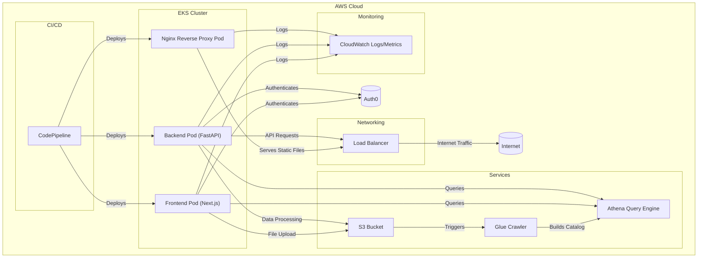

## 1. High-Level Architecture Overview

The application will follow a modern, containerized architecture on AWS, consisting of the following main components:

- **Frontend**: A Next.js application running in an EKS pod, responsible for the user interface, file uploads, data previews, and query execution.
- **Backend**: A FastAPI application running in an EKS pod, handling API requests, data processing, and integration with AWS services.
- **Storage**: Amazon S3 for storing uploaded CSV files and processed data.
- **Data Catalog**: AWS Glue for crawling and building a data catalog from the stored CSV files.
- **Query Engine**: Amazon Athena for running ad-hoc queries on the data catalog.
- **Authentication**: Auth0 for user authentication and authorization.
- **Container Orchestration**: Amazon EKS (Elastic Kubernetes Service) for managing and scaling the application containers.
- **Load Balancing**: AWS Load Balancer for distributing traffic to the EKS cluster.
- **CI/CD**: AWS CodePipeline for continuous integration and deployment.
- **Monitoring**: Amazon CloudWatch for logging and monitoring.

The frontend will communicate with the backend via APIs, which will handle file uploads, data processing, and querying. The backend will store the uploaded files in S3 and trigger Glue crawlers to build the data catalog. Users can then run SQL queries on the catalog using Athena from the frontend. The entire application will be containerized using Docker and deployed on EKS for better scalability and management.

## Architectural Diagram

## 2. API Specification

The API will be implemented using FastAPI and will include the following endpoints:

1. `POST /upload`: Upload a CSV file
   - Request: Multipart form data with file
   - Response: File ID and metadata

2. `GET /preview`: Preview top 100 rows of a file
   - Request: Query parameter with file ID
   - Response: JSON array of objects representing rows

3. `POST /submit`: Submit file to S3 and trigger Glue crawler
   - Request: JSON body with file ID
   - Response: Job ID and status

4. `GET /job-status`: Check status of Glue crawler job
   - Request: Query parameter with job ID
   - Response: Job status and details

5. `POST /query`: Execute Athena query
   - Request: JSON body with SQL query
   - Response: Query results or job ID for long-running queries

All endpoints will require authentication using JWT tokens provided by Auth0.

## 3. Frontend Development Plan

1. Set up Next.js project with TypeScript
2. Implement key UI components using shadcn:
   - FileUpload: For CSV file uploads
   - FilePreview: To display top 100 rows of uploaded file
   - JobStatus: To show Glue crawler job status
   - QueryExecution: For running Athena queries
3. Implement state management using React hooks (useState, useContext)
4. Set up API client for communication with backend
5. Implement error handling and user feedback

## 4. Backend Development Plan

1. Set up FastAPI project with Pydantic for data validation
2. Implement API endpoints as specified in the API specification
3. Integrate with AWS services:
   - S3 for file storage
   - Glue for data cataloging
   - Athena for query execution
4. Implement pandas for CSV processing and data preview
5. Set up error handling and logging
6. Implement authentication and authorization using Auth0

## 5. Infrastructure and Deployment Plan

1. Containerization:
   - Create Dockerfiles for frontend and backend
   - Build and push Docker images to Amazon ECR
2. EKS Deployment:
   - Set up EKS cluster using eksctl or AWS Console
   - Create Kubernetes manifests for deployments, services, and ingress
   - Deploy applications to EKS cluster
3. S3 and Glue Setup:
   - Create S3 bucket for file storage
   - Set up Glue crawler and database
4. Terraform:
   - Create Terraform scripts for infrastructure provisioning
   - Include EKS, S3, Glue, and other AWS resources
5. CI/CD Pipeline:
   - Set up AWS CodePipeline for automated builds and deployments
   - Configure CodeBuild for running tests and building Docker images
   - Use CodeDeploy for EKS deployments

## 6. Scalability and Future Extensibility Considerations

- Horizontal scaling of EKS pods to handle increased load
- Implement caching layer (e.g., Redis) for frequently accessed data
- Use Amazon Aurora Serverless for scalable database storage if needed
- Implement asynchronous processing for long-running tasks
- Consider using AWS Step Functions for complex workflows
- Implement monitoring and alerting using CloudWatch and Prometheus
- Add support for more file formats (e.g., Parquet, Avro)
- Integrate with BI tools for advanced analytics and visualization
- Implement data versioning and rollback capabilities
- Add support for user-defined functions in Athena queries
