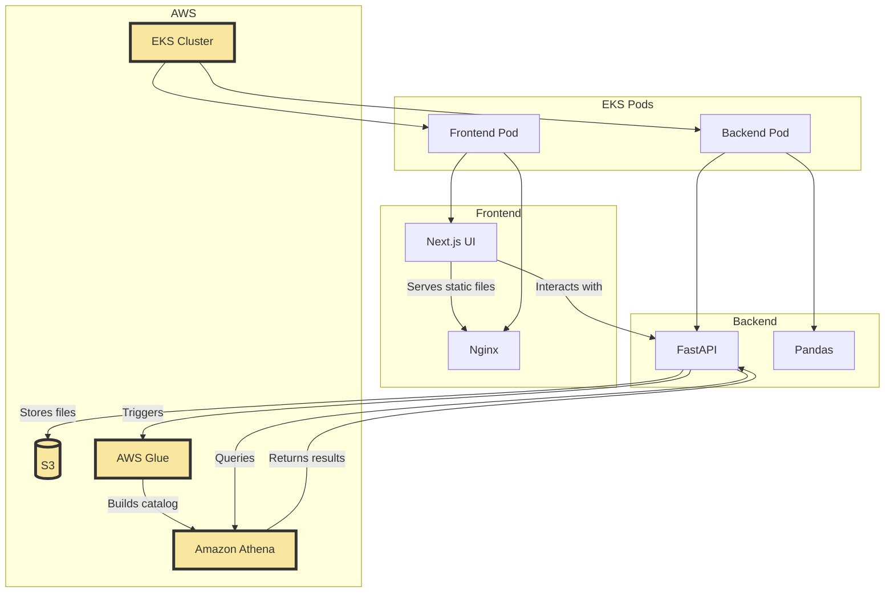

```mermaid
graph TD
    subgraph Frontend
        ui[Next.js UI]
        nginx[Nginx]
    end

    subgraph Backend
        api[FastAPI]
        pandas[Pandas]
    end

    subgraph AWS
        s3[(S3)]
        glue[AWS Glue]
        athena[Amazon Athena]
        eks[EKS Cluster]
    end

    ui --> |Interacts with| api
    api --> |Stores files| s3
    api --> |Triggers| glue
    glue --> |Builds catalog| athena
    api --> |Queries| athena
    athena --> |Returns results| api
    ui --> |Serves static files| nginx

    subgraph EKS Pods
        frontend_pod[Frontend Pod]
        backend_pod[Backend Pod]
    end

    frontend_pod --> ui
    frontend_pod --> nginx
    backend_pod --> api
    backend_pod --> pandas

    eks --> frontend_pod
    eks --> backend_pod

    classDef aws fill:#f9e79f,stroke:#333,stroke-width:4px;
    class s3,glue,athena,eks aws
```