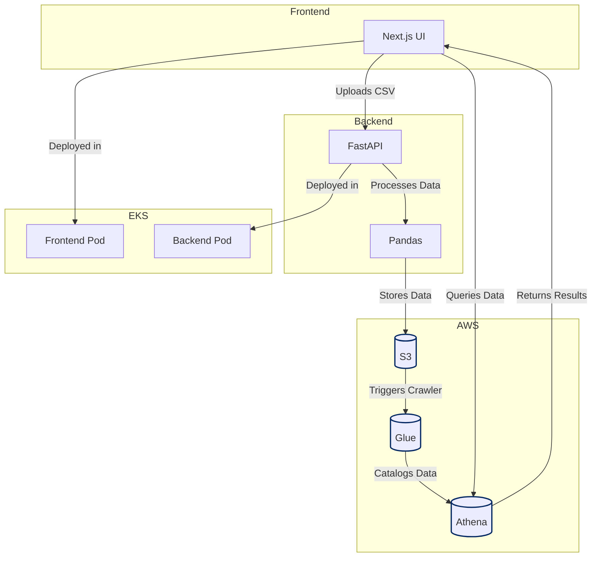

```mermaid
graph TD
    subgraph Frontend
        ui[Next.js UI]
    end

    subgraph Backend
        api[FastAPI]
        pandas[Pandas]
    end

    subgraph AWS
        s3[(S3)]
        glue[(Glue)]
        athena[(Athena)]
    end

    ui -- Uploads CSV --> api
    api -- Processes Data --> pandas
    pandas -- Stores Data --> s3
    s3 -- Triggers Crawler --> glue
    glue -- Catalogs Data -->athena
    ui -- Queries Data --> athena
    athena -- Returns Results --> ui

    subgraph EKS
        frontend[Frontend Pod]
        backend[Backend Pod]
    end

    ui -- Deployed in --> frontend
    api -- Deployed in --> backend

    classDef awsService stroke:#052962,stroke-width:2px;
    class s3,glue,athena awsService;
```